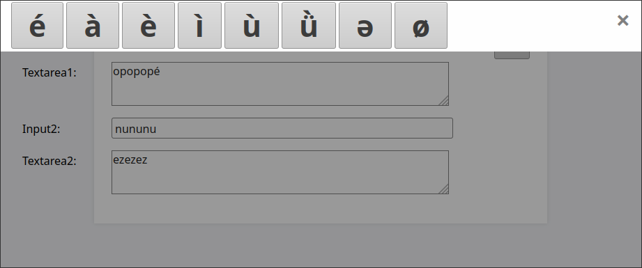

# jsCharPick
A simple HTML/Javascript character picker

## What is it?
This is a minimalist implementation of a HTML/Javascript special character picker.

Imagine that you have a website with a number of text input fields and that you want to offer your users an easy way to input certain special characters which they might not have available on their keyboards. They would therefore appreciate to be able to pick them from a list. That is what jsCharPick does. It slides in a list of special characters from the top of the page and when the user clicks on one of them, the character is then inserted into the last used input or textarea field at the position of the caret.

Note that you need to click on one of the input fields to give it focus first, otherwise the script will not know where to insert the character and will do nothing.

Note on the origin of the code: Some of the markup and code is adapted from online tutorials and from stackexchange answers.

## Demo
https://swanrad.ch/jsCharPick/jsCharPick.html - live demo
